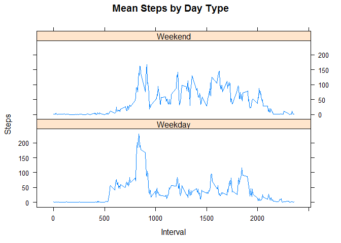

# PA1_template.Rmd
Ian Dwyer  
January 15, 2017  


## Reading the Data
This is where we will read the data into R. 


```r
actData <- read.csv("activity.csv")
```

## Question 1 - What is mean total number of steps taken per day?

Calculate the total steps per day.

```r
library(dplyr)
```

```
## 
## Attaching package: 'dplyr'
```

```
## The following objects are masked from 'package:stats':
## 
##     filter, lag
```

```
## The following objects are masked from 'package:base':
## 
##     intersect, setdiff, setequal, union
```

```r
dailySteps <- actData %>% group_by(date) %>% summarise(totSteps = sum(steps), 
                                                      meanSteps = mean(steps, na.rm=TRUE),
                                                      medSteps = median(steps))
```

This is a historgram of total steps per day.


```r
hist(dailySteps$totSteps, col = "light blue", main = "Total Daily Steps",
        xlab = "Total Steps")
```

<!-- -->

The mean of steps per day.

```r
mean(dailySteps$totSteps, na.rm = TRUE)
```

```
## [1] 10766.19
```

The median steps per day.

```r
median(dailySteps$totSteps, na.rm = TRUE)
```

```
## [1] 10765
```

## Question 2 - What is the average daily activity pattern?

Calculate the average steps per interval over all days and plot the pattern.

```r
intervalSteps <- actData %>% group_by(interval) %>% 
                summarise(meanSteps = mean(steps, na.rm = TRUE))


 plot(intervalSteps$interval, intervalSteps$meanSteps, type = "l", xlab = 'Interval', ylab = 'Average Steps')
```

<!-- -->

This is the interval with the maximum number of steps.

```r
intervalSteps[intervalSteps$meanSteps == max(intervalSteps$meanSteps),]
```

```
## # A tibble: 1 x 2
##   interval meanSteps
##      <int>     <dbl>
## 1      835  206.1698
```

## Question 3 - Imputing Missing Values

The approach for imputing missing values is to take the average number of steps for an interval and apply it to any day and interval that does not have a value recorded.


Here is the number of observations with missing values.

```r
actDataImpute <- actData

acdiNA <- is.na(actDataImpute$steps)

length(acdiNA[acdiNA == TRUE])
```

```
## [1] 2304
```


```r
actDataImpute$steps[acdiNA] <- intervalSteps[match(actDataImpute$interval[acdiNA], intervalSteps$interval),]$meanSteps

dailyStepsImp <- actDataImpute %>% group_by(date) %>% summarise(totSteps = sum(steps), 
                                                      meanSteps = mean(steps),
                                                      medSteps = median(steps))
```

A histogram using the new datset. You can see there are now  higher number of days in the 10,000 - 15,000 group.

```r
hist(dailyStepsImp$totSteps, col = "light blue", main = "Total Daily Steps",
        xlab = "Total Steps")
```

<!-- -->

Here is the mean of total steps after imputing missing values.

```r
mean(dailyStepsImp$totSteps, na.rm = TRUE)
```

```
## [1] 10766.19
```

Here is the median of total steps after imputing missing values.

```r
median(dailyStepsImp$totSteps, na.rm = TRUE)
```

```
## [1] 10766.19
```

After imputing missing values the median and the mean are now the same.

## Question 4 - Are there differences in activity patterns between weekdays and weekends?

Add a factor to the data to identify if a date is a weekday or a weekend and calculate the mean steps by initerval and day type.

```r
actDataImpute$dayType <- as.factor(ifelse(weekdays(as.POSIXct(actDataImpute$date), abbr = TRUE) %in% c('Sat', 'Sun'), 'Weekend', 'Weekday'))

intervalStepsimp <- actDataImpute %>% group_by(interval, dayType) %>% 
                summarise(meanSteps = mean(steps, na.rm = TRUE))
```

A time series plot of average number of steps by interval and day type. 


```r
library(lattice)

xyplot(meanSteps ~ interval | dayType, data = intervalStepsimp, type = "l", layout = c(1,2), main = "Mean Steps by Day Type", ylab = 'Steps', xlab = 'Interval')
```

<!-- -->


